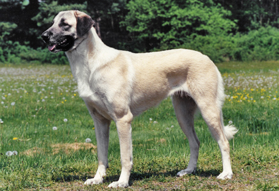

# anatolian

Large, rugged and powerful, the Anatolian Shepherd Dog is a working guard dog, possessing
a superior ability to protect livestock. While not a "glamour" breed, the Anatolian's 
loyalty, independence and hardiness is cherished by breeders and owners. They are known to bark all night, though.

